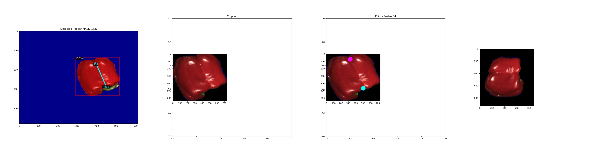

# Vegetable-Phenotyping
Vegetable phenotyping using detectron2 and deplyment using restapi

### Features

1) Phenotyping of Peppers using 2D Images including detection orientation correction and dimension measurements. Deployment of trained model using RESTAPI
2) Cucumber Detection and Phenotyping

### Structure

---> Detectron2 contains modified detectron2 
---> notebooks contain experimental notebooks
---> pepper contains training, inference and deployment scripts for pepper phenotyping

### Results for pepper Detection and Orientation correction 

  

    
  

    

  
